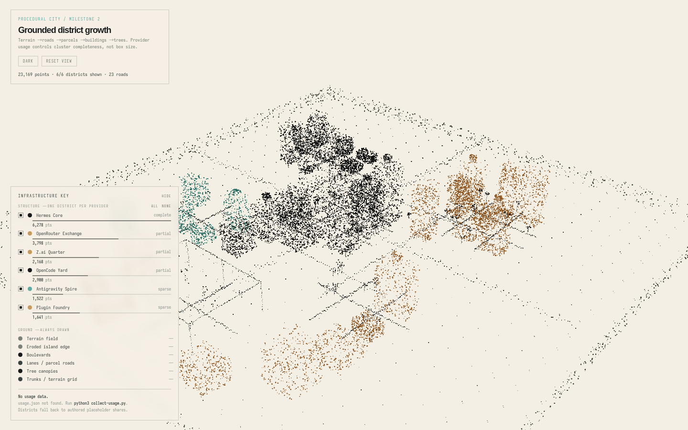
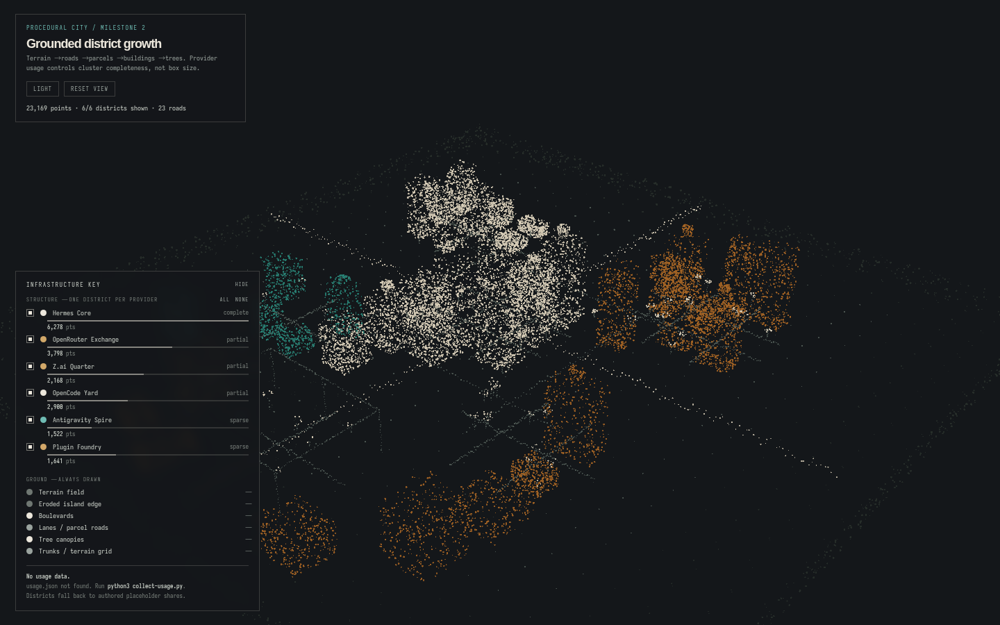
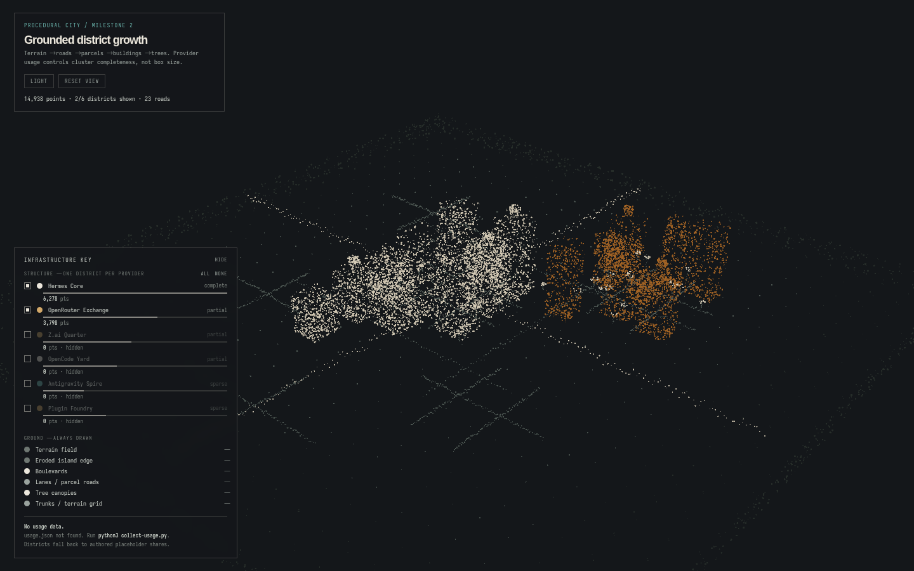
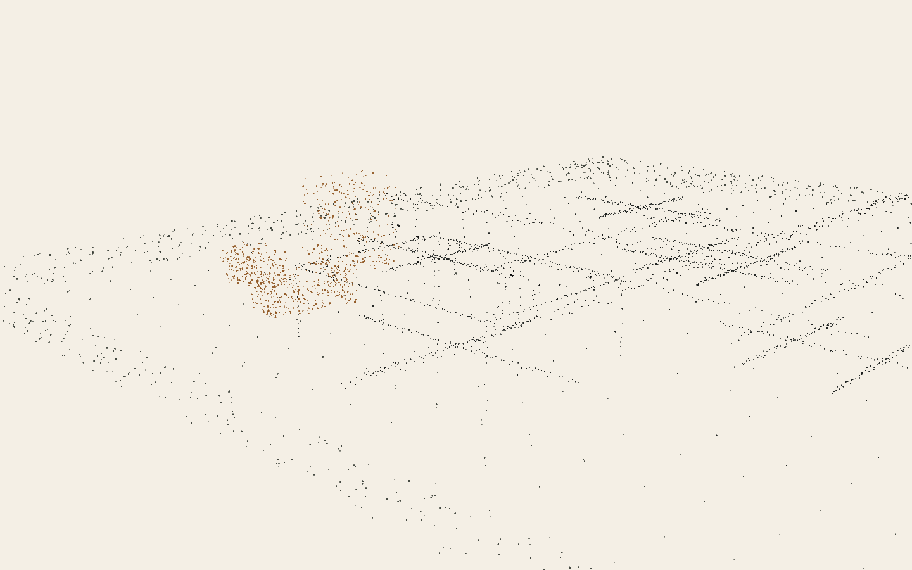

<div align="center">

# point-cloud-city

**A procedural city drawn entirely as pencil stipple, where every district is a real AI provider — and its completeness is that provider's measured usage.**

[](LICENSE)
[](https://threejs.org)
[](#stack-rules)
[](#stack-rules)
[](#how-the-data-works)
[](#contributing)



</div>

---

## Why

Most usage dashboards are bar charts. This is a place.

Every district is a provider. Its point density, parcel count, building height and road density all
derive from that provider's **real reported usage** — so the shape of the city is the shape of your
own stack. If a district looks built, that provider is genuinely heavy.

And where it *cannot* know something, it says so rather than inventing it. A provider with no API
key, or with no usage API at all, renders as sparse scaffold and labels itself blind. That rule is
the whole point of the project: **a gap in knowledge is never papered over into a confident-looking
structure.**

## Features

- **Pencil-stipple rendering** — points biased toward silhouettes, corners and edges, jittered off
  any grid, density varying with height. The pass/fail test is whether it reads as hand-drawn
  architecture, not frame rate.
- **One district per provider** — Hermes, OpenRouter, Z.ai, OpenCode, Gemini/Antigravity.
- **Honest by construction** — unmeasured districts are labelled, never silently filled in.
- **Light and dark themes**, remembered between visits.
- **Per-district filtering** — show any combination, or nothing but the bare island.
- **Two axes of growth** — the island resizes to hold new districts (sideways), and a district can
  be raised onto a tiered deck on support columns (up).
- **Data-driven, not code-driven** — extend the city by editing `city.json`; the renderer stays put.
- **No dependencies, no build** — two vendored library files and a static server.

## Screenshots

| Dark theme | District filter |
|---|---|
|  |  |

**Vertical growth** — a district raised onto a deck, held up by support columns that reach the
terrain, so it never reads as architecture floating in mid-air:



## Quick start

ES modules will not load over `file://` — you need a server.

```bash
git clone https://github.com/a77lic7ion/point-cloud-city.git
cd point-cloud-city
node server.mjs          # serves the page AND the collect endpoint
```

Open <http://127.0.0.1:8221/procedural-city-demo.html>.

`server.mjs` defaults to `127.0.0.1` and never `0.0.0.0`. To open it on your *phone*, give it this
machine's LAN address (or a Tailscale address) instead:

```bash
HOST=192.168.1.79 node server.mjs      # or HOST=100.x.y.z for Tailscale
```

Any plain static server also works, but then the **COLLECT + BUILD** button has no endpoint to
call and says so on screen. Only `server.mjs` can refresh usage on demand.

Out of the box you get the authored city with placeholder completeness — the footer says as much.
To wire in real usage:

```bash
python3 collect-usage.py
```

It reads Hermes's local session database and any provider keys present in the environment:

| Variable | Provider | Reads |
|---|---|---|
| `OPENROUTER_API_KEY` | OpenRouter | account credits |
| `ZAI_API_KEY` | Z.ai / Zhipu | quota limit |
| `OPENCODE_GO_API_KEY` | OpenCode Go / Zen | usage windows |

A missing key is not an error: that provider is reported as `no key set` and its district stays
sparse. The script **never writes, logs or transmits a key value** — only whether one is present.

## Deploy to Vercel

No build step and no framework to configure. Import the repo and Vercel serves it as-is;
[`vercel.json`](vercel.json) maps `/` to the demo page and gives the vendored Three.js files
immutable caching.

> `usage.json` and `history.json` are gitignored — they hold your session counts and account spend.
> Without them a deployed site shows the authored city and says so on screen. Commit them only if
> you want that data public.

A static host cannot run the collector, so **COLLECT + BUILD** reports that there is no collector
on that host rather than failing silently. To refresh a deployment, run `collect-usage.py` locally
and commit the result (only if you want those figures public).

## Controls

| Input | Action |
|---|---|
| **COLLECT + BUILD** | Re-read usage now and rebuild the city, with a stipple-in animation (needs `server.mjs`) |
| `T`, or the button | Light / dark theme |
| `L` | Show / hide the legend |
| `R` | Reset the camera |
| Legend checkboxes | Show any combination of districts |
| `ALL` / `NONE` | Every district, or the bare island |
| Drag / scroll | Orbit / zoom |

Deep links: `?theme=dark&only=hermes,openrouter`. A query parameter applies to that load only and
never overwrites a saved preference.

## How the data works

Provider figures come from each provider's own **account-level** endpoint. That is what makes
"usage across any application" work without instrumenting anything: query the account, not the app.
Every application using that account appears in the same number, and nothing has to cooperate.

Two kinds of number appear here, and they are never conflated:

| | |
|---|---|
| **Measured** | Read from a real source, and shown with the figure behind it. |
| **Placeholder** | Used only where nothing could be measured, and labelled as such on screen. |

Districts bind to providers through `source`, and completeness is the measured value set against a
declared reference scale:

```jsonc
{
  "id": "openrouter",
  "name": "OpenRouter Exchange",
  "source": "openrouter",                          // binds to usage.json
  "reference": { "metric": "usd", "full": 5 },     // $5 of spend = fully built
  "tokenShare": 0.62,                              // FALLBACK only, when nothing is measured
  "origin": { "x": 8.8, "z": -7.0 },
  "size": { "width": 8.3, "depth": 7.4 },
  "style": "laboratory",                           // civic | laboratory | residential | archive | industrial
  "accent": "amber"                                // ink | amber | teal
}
```

The reference scale is declared rather than hidden in code, because an absolute usage number cannot
become a 0–1 density without one. Change it and the district rebuilds.

Districts added by hand or by an agent carry no `source`, and must carry `evidence` — the real thing
they map to. No evidence, no district.

## Growth

- **Sideways** — the island is sized from the districts' actual extents, so placing a district
  beyond the current edge *expands* the city instead of leaving it floating off the plot. Terrain
  stipple density scales with it, so a larger city is not a thinner one.
- **Up** — `"tier": 1` lifts a district onto a deck with a rim, a deck grid, and support columns
  running down to the terrain. The columns are what stop it reading as floating buildings.

## Stack rules

Deliberately unfashionable, and load-bearing — these are constraints, not defaults:

- Single self-contained page. Plain JS. **No npm, no bundler, no build step, no framework.**
- Three.js **r186** as ES modules, vendored locally, resolved through an
  [import map](procedural-city-demo.html). Never the UMD `OrbitControls` `<script>` pattern.
- Rendering is **instanced screen-facing quads with a custom `ShaderMaterial`** — CSS-pixel dot
  sizing that stays constant across depth *and* device pixel ratio, circular dots via `discard`,
  one draw call. Not `THREE.Points`: `gl_POINTS` sizing is inconsistent across GPUs and balloons on
  high-DPI displays.

## Project layout

| File | Role |
|---|---|
| `procedural-city-demo.html` | The page — legend, themes, filter, usage wiring |
| `procedural-city-renderer.js` | Renderer. Owns `THEMES`; rebuilds points in place |
| `procedural-city-data.js` | Geometry — terrain, roads, parcels, buildings, trees. Sizes the island |
| `city.json` | The city definition. Districts bind to providers via `source` |
| `server.mjs` | Node server. Serves the files and exposes `POST /api/collect` for the button |
| `collect-usage.py` | Collects Hermes + provider usage → `usage.json`, `history.json` |
| `TARGET.md` | The design spec, including the rules that keep it honest |

The split is deliberate: **the renderer is code, the city is data.** The city can be extended by
editing `city.json` alone.

## Contributing

Contributions are welcome — see [CONTRIBUTING.md](CONTRIBUTING.md). The short version: the data
honesty rules and the stack rules above are not up for negotiation, and the pass/fail test for any
visual change is whether it still reads as stippled architecture.

## Licence

[MIT](LICENSE).